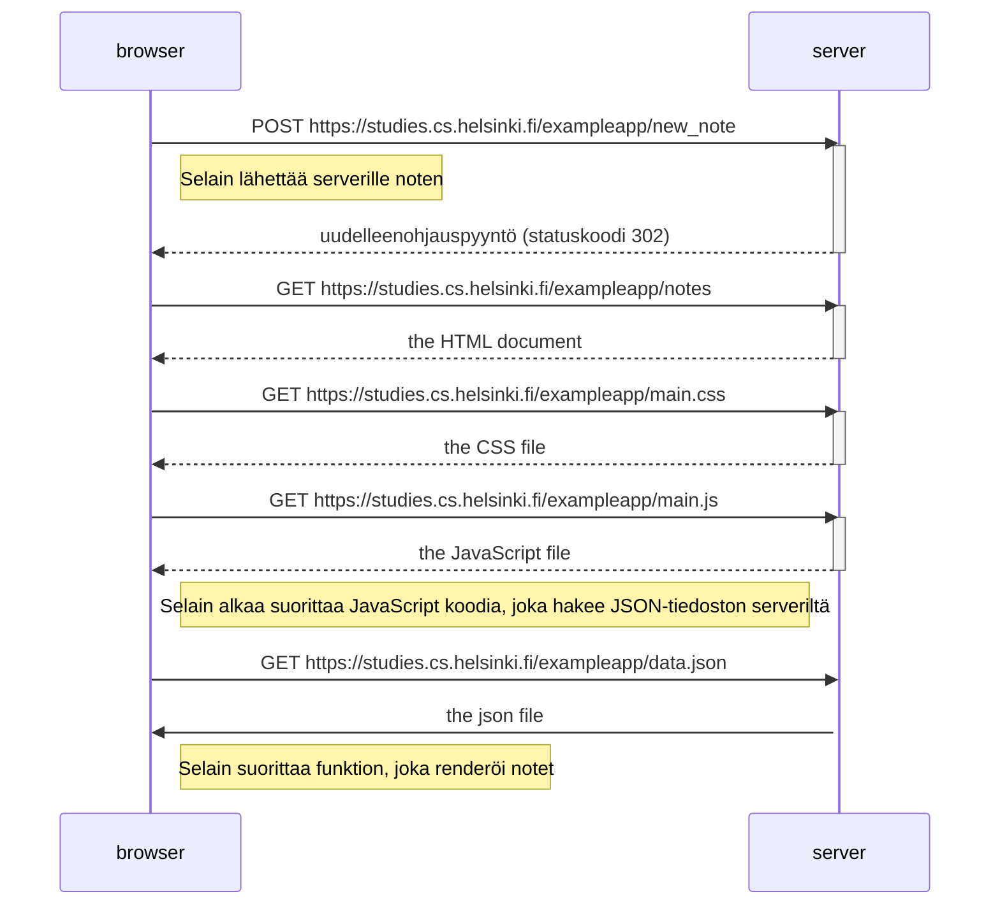

Kaavio: käyttäjä luo uuden muistiinpanon ollessaan sivulla https://studies.cs.helsinki.fi/exampleapp/notes

```mermaid
sequenceDiagram
participant browser
    participant server
    
    browser->>server: POST https://studies.cs.helsinki.fi/exampleapp/new_note
    activate server
    Note right of browser: Selain lähettää serverille noten
    server-->>browser: uudelleenohjauspyyntö (statuskoodi 302)
    deactivate server
    
    browser->>server: GET https://studies.cs.helsinki.fi/exampleapp/notes
    activate server
    server-->>browser: the HTML document
    deactivate server
    
    browser->>server: GET https://studies.cs.helsinki.fi/exampleapp/main.css
    activate server
    server-->>browser: the CSS file
    deactivate server
    
    browser->>server: GET https://studies.cs.helsinki.fi/exampleapp/main.js
    activate server
    server-->>browser: the JavaScript file
    deactivate server 

    Note right of browser: Selain alkaa suorittaa JavaScript koodia, joka hakee JSON-tiedoston serveriltä

    browser->>server: GET https://studies.cs.helsinki.fi/exampleapp/data.json
    activate server
    server->>browser: the json file

    Note right of browser: Selain suorittaa funktion, joka renderöi notet
```